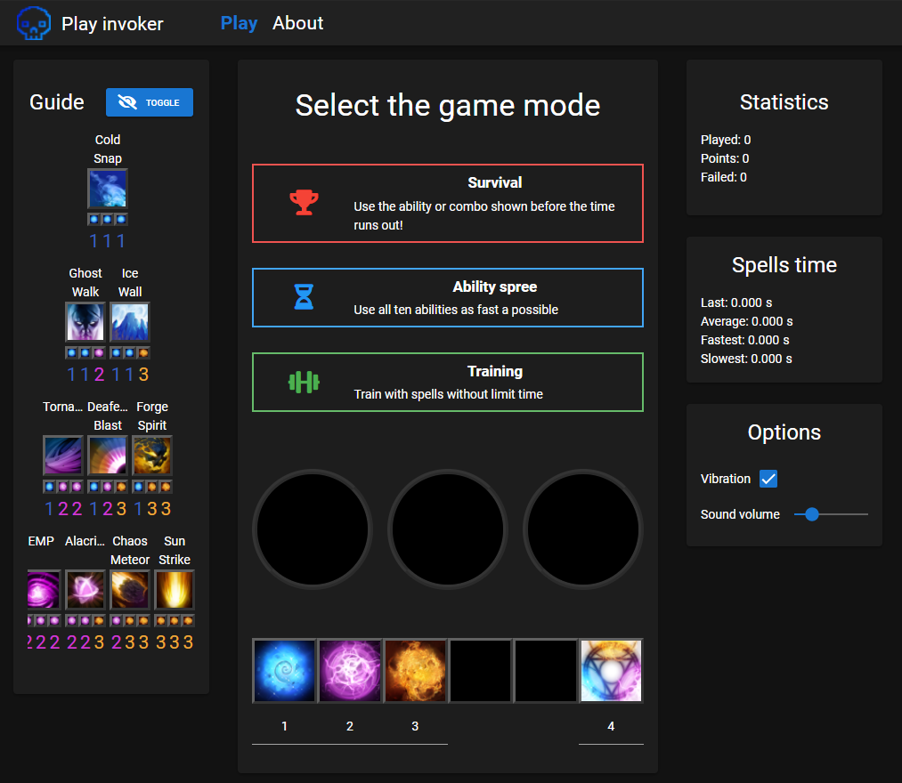
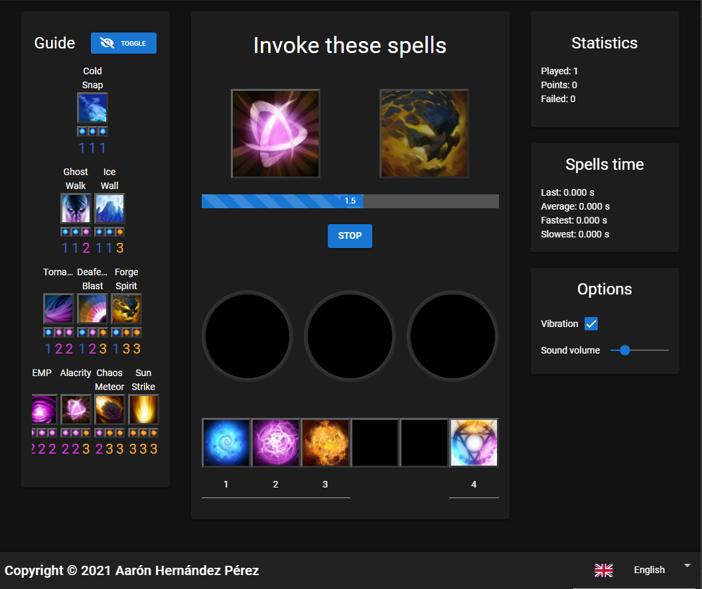

# invoker-test (invoker-test)

A game made to Improve your Invoker skills, made with Typescript Vue3, Vuex, quasar and i18n

<p align="center" >
  
</p>

<p align="center" >
  
</p>

## Install the dependencies

```bash
yarn
```

### Start the app in development mode (hot-code reloading, error reporting, etc.)

```bash
quasar dev
quasar dev -m capacitor -T android
```

### Lint the files

```bash
yarn lint
# or
npm run lint
```

Open emulator
```bash
D:\Android-sdk\emulator\emulator.exe  -avd Pixel_3a_API_28 -netdelay none -netspeed full
```

### Format the files

```bash
yarn format
```

### Build the app for production

```bash
quasar build
```

### Customize the configuration

See [Configuring quasar.config.js](https://v2.quasar.dev/quasar-cli-webpack/quasar-config-js).

# Sign Capacitor android apk

### Generates Key
pass: 123456
```bash
keytool -genkey -v -keystore my-release-key.keystore -alias alias_name -keyalg RSA -keysize 2048 -validity 20000
```
###  Signs apk with key
```bash
jarsigner -verbose -sigalg SHA1withRSA -digestalg SHA1 -keystore my-release-key.keystore dist/capacitor/android/apk/release/app-release-unsigned.apk alias_name
```
###  Generates signed apk
```bash
zipalign -v 4 dist/capacitor/android/apk/release/app-release-unsigned.apk PlayInvoker.apk
```


## Capacitor issues
If there is the following issue when running
```
Manifest merger failed : Attribute application@appComponentFactory value=(android.support.v4.app.CoreComponentFactory) from [com.android.support:support-compat:28.0.0] AndroidManifest.xml:22:18-91
	is also present at [androidx.core:core:1.2.0] AndroidManifest.xml:24:18-86 value=(androidx.core.app.CoreComponentFactory).
	Suggestion: add 'tools:replace="android:appComponentFactory"' to <application> element at AndroidManifest.xml:5:5-44:19 to override.
```

Add this to "src-capacitor\android\gradle.properties"
```
android.useAndroidX=true
android.enableJetifier=true
```

If the app crash on startup change this in "src-capacitor\android\app\src\main\AndroidManifest.xml"
```
android:name="android.support.v4.content.FileProvider"
```
to
```
android:name="androidx.core.content.FileProvider"
```

Also install the following dependencies

```bash
yarn add -D @capacitor/core
```

### TODO
steam integration
